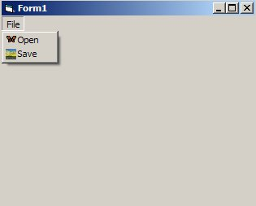

<div align="center">

## Add Bitmaps To Menu


</div>

### Description

Demonstrates how to add bitmaps to menus using VB 5 or 6
 
### More Info
 


<span>             |<span>
---                |---
**Submitted On**   |2003-03-11 06:23:04
**By**             |[Philip Pierce](https://github.com/Planet-Source-Code/PSCIndex/blob/master/ByAuthor/philip-pierce.md)
**Level**          |Advanced
**User Rating**    |5.0 (35 globes from 7 users)
**Compatibility**  |VB 5\.0, VB 6\.0
**Category**       |[VB function enhancement](https://github.com/Planet-Source-Code/PSCIndex/blob/master/ByCategory/vb-function-enhancement__1-25.md)
**World**          |[Visual Basic](https://github.com/Planet-Source-Code/PSCIndex/blob/master/ByWorld/visual-basic.md)
**Archive File**   |[Add\_Bitmap1557823112003\.zip](https://github.com/Planet-Source-Code/philip-pierce-add-bitmaps-to-menu__1-43924/archive/master.zip)

### API Declarations

```
Declare Function GetMenuItemCount Lib "user32" (ByVal hMenu As Long) As Long
Declare Function GetMenuItemInfo Lib "user32" Alias "GetMenuItemInfoA" (ByVal hMenu As Long, ByVal un As Long, ByVal b As Boolean, lpMenuItemInfo As MENUITEMINFO) As Boolean
Declare Function GetMenu Lib "user32" (ByVal hwnd As Long) As Long
Declare Function GetSubMenu Lib "user32" (ByVal hMenu As Long, ByVal nPos As Long) As Long
Declare Function GetMenuItemID Lib "user32" (ByVal hMenu As Long, ByVal nPos As Long) As Long
Declare Function SetMenuItemBitmaps Lib "user32" (ByVal hMenu As Long, ByVal nPosition As Long, ByVal wFlags As Long, ByVal hBitmapUnchecked As Long, ByVal hBitmapChecked As Long) As Long
```


